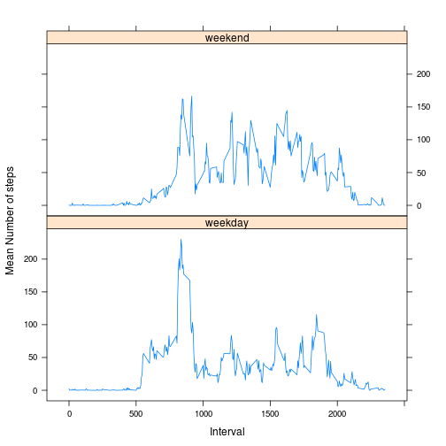

# Reproducible Research: Peer Assessment 1


## Loading and preprocessing the data
Data comes from a personal activity monitoring device.
This device collects data at 5 minute intervals through out the day. The data
consists of two months of data from an anonymous individual collected during
the months of October and November, 2012 and include the number of steps
taken in 5 minute intervals each day.
The dataset is stored in a comma-separated-value (CSV) file and there are a
total of 17,568 observations in this dataset.


```r
# unzip and load activity.zip dataset
#Download and unzip files
destFile = "activity.csv"
if(!file.exists(destFile)) {
    unzip("activity.zip", exdir=".")
}
activity <- read.csv (destFile)
completeActivity <- activity[complete.cases(activity), ]  # removing NAs.

head (activity)
```

```
##   steps       date interval
## 1    NA 2012-10-01        0
## 2    NA 2012-10-01        5
## 3    NA 2012-10-01       10
## 4    NA 2012-10-01       15
## 5    NA 2012-10-01       20
## 6    NA 2012-10-01       25
```

The variables included in this dataset are:

* **steps:** Number of steps taking in a 5-minute interval (missing values are
coded as NA)

* **date:** The date on which the measurement was taken in YYYY-MM-DD
format

* **interval:** Identifier for the 5-minute interval in which measurement was
taken

## What is mean total number of steps taken per day?

```r
stepsForDays <- aggregate(activity$steps, by=list(activity$date), FUN="sum")
hist (stepsForDays$x, main = "Histogram of Steps For Days", xlab ="Steps For Days")
```

 

```r
# mean o the steps
mean(stepsForDays$x,na.rm = TRUE)
```

```
## [1] 10766
```

```r
# median of the steps
median(stepsForDays$x,na.rm = TRUE)
```

```
## [1] 10765
```
 

## What is the average daily activity pattern?
Time series plot of the 5-minute interval (x-axis)
and the average number of steps taken, averaged across all days (y-axis)


```r
stepsForInterval <- aggregate(completeActivity$steps, by=list(completeActivity$interval), FUN="mean")
colnames(stepsForInterval) <- c("Interval","Steps")
plot (stepsForInterval$Interval, stepsForInterval$Steps, type = "l", main = "Mean steps for Interval", xlab ="Interval", ylab="Mean steps")
```

 

Which 5-minute interval, on average across all the days in the dataset,
contains the maximum number of steps?

```r
stepsForInterval [which.max( stepsForInterval$Steps ),]
```

```
##     Interval Steps
## 104      835 206.2
```

## Imputing missing values
Total number of missing values in the dataset
(i.e. the total number of rows with NAs)

```r
# Num of NA in each column 
colSums (is.na (activity))
```

```
##    steps     date interval 
##     2304        0        0
```
Replace NA


```r
# Replacing the steps of the rows having NAs with the mean steps for each
# 5-min interval across the all data
activityfull <- activity
for (i in 1:nrow(activityfull)) {
    i
    if (is.na (activityfull[i,1])) {
        activityfull[i, 1] <- stepsForInterval[stepsForInterval$Interval == activityfull[i,]$interval,]$Steps
    }
}
```

Histogram of the total number of steps taken each day

```r
stepsForDaysNoNa <- aggregate(activityfull$steps, by=list(activityfull$date), FUN="sum")
par(mfrow = c(1, 2))
hist (stepsForDays$x, main = "Histogram of Steps For Days (with NA)", xlab ="Steps For Days")
hist (stepsForDaysNoNa$x, main = "Histogram of Steps For Days (NA replaced)", xlab ="Steps For Days")
```

 

```r
# mean o the steps
mean(stepsForDaysNoNa$x,na.rm = TRUE)
```

```
## [1] 10766
```

```r
# median of the steps
median(stepsForDaysNoNa$x,na.rm = TRUE)
```

```
## [1] 10766
```
Do these values differ from the estimates from the first part of the assignment?
What is the impact of imputing missing data on the estimates of the total
daily number of steps?

The Histogram has the same shape but the frequency are slightly higher due too the increased data size without NA
Mean and Median does not change significantly from the previous computation ignoring the NA


## Are there differences in activity patterns between weekdays and weekends?
Dataset with a new factor variable with two levels – “weekday”
and “weekend” indicating whether a given date is a weekday or weekend
day

```r
activityfull$wd <- weekdays(as.Date(activityfull$date))
activityfull$wd <- ifelse(activityfull$wd %in% c("Saturday", "Sunday"), "weekend", "weekday")
```
Panel plot containing a time series plot of the
5-minute interval (x-axis) and the average number of steps taken, averaged
across all weekday days or weekend days (y-axis).


```r
library(lattice)
activityByWdAndInterval <- aggregate(activityfull$steps, by = list(activityfull$wd, activityfull$interval), mean)
names(activityByWdAndInterval) <- c("WeekDay", "Interval","mean.steps")
xyplot(activityByWdAndInterval$mean.steps ~ activityByWdAndInterval$Interval | 
    activityByWdAndInterval$WeekDay, layout = c(1, 2), type = "l", xlab = "Interval", 
    ylab = " Mean Number of steps")
```

 

